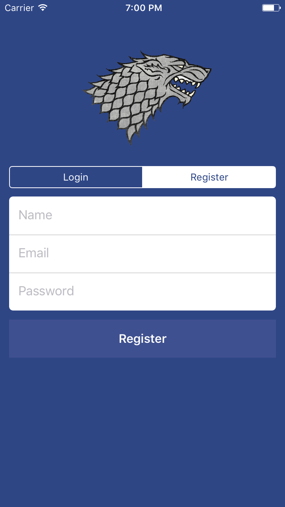
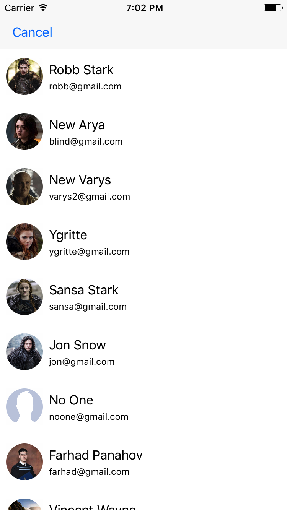
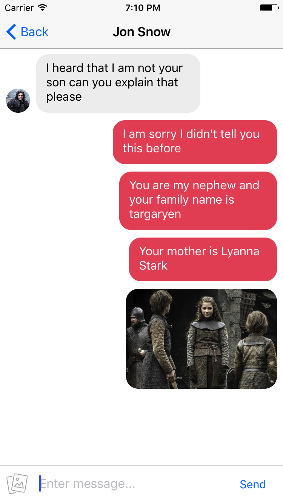
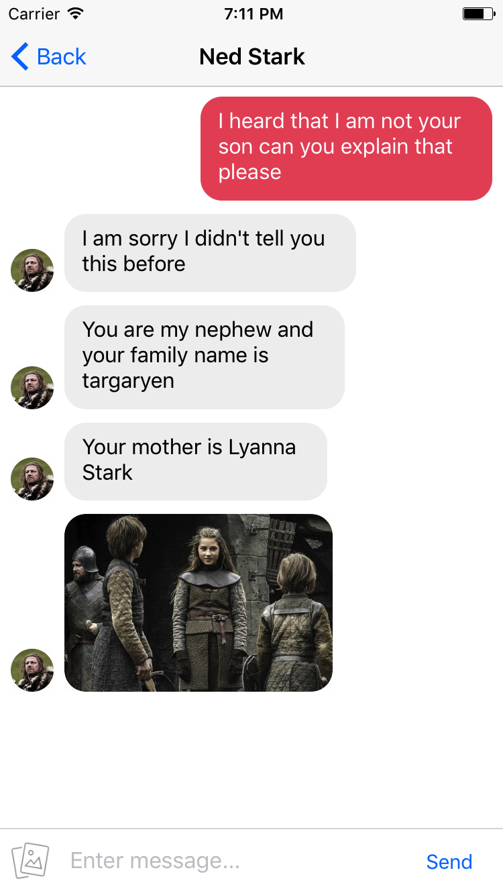

# IOS-ChatAPP

ChatApp is Facebook Messenger clone

Users can register and login to access the features of this application
Users are able to message each other with images, videos or text

1. Firebase Database to store messages between each user
2. Firebase Storage to save files(image, videos) sent between users
3. Firebase Authentication to save each user

Screenshots
-----------

  
 
